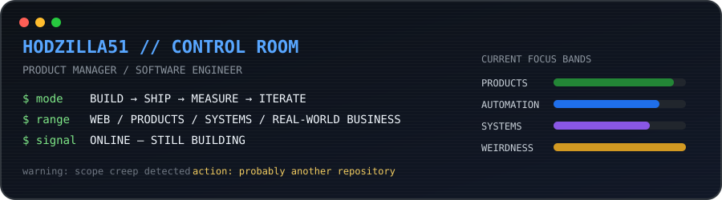
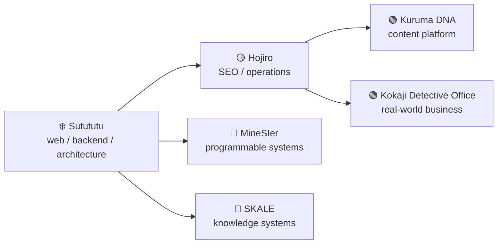

<!-- If you're reading the source: hello. Scope creep lives here. -->

# Hodzilla51 👋

<p align="center">
  
</p>

**Product Manager / Software Engineer**

曖昧なアイデアを整理し、要件・設計・実装から、公開後の運用や改善まで自分で手を動かしています。  
Web、コンテンツ、事業、ゲーム内コンピュータまで、興味を持ったものを実際に作って確かめるのが好きです。

<details>
<summary><strong>English</strong></summary>
<br>

I turn ambiguous ideas into working products — from requirements and architecture to implementation, operation, and iteration.  
My projects range from web and content platforms to real-world businesses and programmable computers inside Minecraft.

</details>

`🟢 Active`　`🧪 Experimental`　`🟡 Maintenance`　`❄️ Paused / Frozen`

> **基本方針:** 企画だけで終わらせない。コードだけでも終わらせない。公開して、使われ方を見る。

## 🚀 現在のプロジェクト / Active Projects

### 🟢 [クルマのDNA / Kuruma DNA](https://kuruma-dna.com/)

自動車のモデルや世代のつながり、設計思想をたどるWebメディア。企画・サイト開発・コンテンツ設計・SEO・運用改善まで行っています。Next.jsとWordPressを組み合わせ、車種・世代を横断して読み進められる情報構造や、大規模なコンテンツ運用の改善・自動化にも取り組んでいます。

**Areas:** Next.js / TypeScript / WordPress / SEO / Information Architecture

<details><summary>English</summary><br>
An automotive media platform focused on model lineage and engineering ideas. I work across product planning, development, content architecture, SEO, and operation, including improvements and automation for large-scale content management.
</details>

### 🟡 [ほおじろ通信 / Hojiro](https://hojiro.tokyo/)

バイク・ガジェット・キャンプなどを扱う個人メディア。長期運営を通して、検索需要の発見、記事設計、SEO、サイト改善を実践してきたプロジェクトです。

**Areas:** WordPress / Content Strategy / SEO / Media Operations

<details><summary>English</summary><br>
A long-running personal media site covering motorcycles, gadgets, camping, and related topics. It has served as a practical environment for learning search demand, content design, SEO, and continuous site improvement.
</details>

### 🟢 [小鍛治探偵事務所 / Kokaji Detective Office](https://kkjd.tokyo/)

自分で立ち上げた調査事業。サービス企画だけでなく、Webサイト、相談・受注導線、SEO/MEO、広告、運用フローまで構築し、実際の需要を検証しています。

**Areas:** Product / Business Design / Web Development / SEO & MEO / Operations

<details><summary>English</summary><br>
A real-world investigation business I launched as a product and business experiment. I design not only the service itself, but also its website, acquisition funnel, SEO/MEO, advertising, and operational workflow.
</details>

### 🧪 [MineSIer](https://github.com/hodzilla51/minesier)

Minecraft内に、JavaScriptでプログラムできるコンピュータ、ロボット、ストレージ、ネットワークを構築する実験的Mod。Mozilla Rhinoによるサンドボックス実行環境、プログラマブルTurtle、仮想NIC、L2通信、学習スイッチ、IPv4風パケット、暗号APIなどを実装しています。

**Tech:** Java / JavaScript / Fabric / Mozilla Rhino / Virtual Networking / Cryptography

<details><summary>English</summary><br>
An experimental Minecraft mod for building programmable systems in-game: computers, robots, portable storage, and networks controlled with JavaScript. It includes a sandboxed Rhino runtime, programmable turtles, virtual NICs, L2 networking, a learning switch, IPv4-inspired packets, and cryptographic APIs.
</details>

### 🧪 [SKALE](https://github.com/hodzilla51/skale)

司法試験で要求される法的推論を、人間が限られた時間と記憶容量で実行できる形まで圧縮・構造化できるかを検証する研究プロジェクト。現在は初期設計・実験段階で、効果はまだ実証していません。

**Areas:** Knowledge Compression / Legal Reasoning / Human-executable Systems / Evaluation Design

<details><summary>English</summary><br>
An experimental research project exploring whether legal reasoning for Japanese legal examinations can be compressed into a small, human-executable system while preserving required performance. It is still in early experimental design; no effectiveness claim yet.
</details>

## ❄️ 凍結・過去のプロジェクト / Paused & Archived

現在は積極的に開発していませんが、技術的な試行錯誤と興味の変遷を残すためのプロジェクトです。

<details><summary>English</summary><br>
Projects that are no longer under active development, kept as a record of technical experiments and how my interests have evolved.
</details>

### ❄️ Sutututu

サーキット走行の記録を投稿し、サーキット・レイアウト・車種などで絞り込んで比較するSNS。二輪・四輪を対象に、ユーザー認証、記録投稿、検索、リザルト表示などを開発しました。

開発の途中で複数回アーキテクチャを見直し、React / Go / Cassandra / Keycloak / Docker を用いた構成から、Next.js / Node.js / PostgreSQL を中心とする構成まで試行しました。コードを書くことだけでなく、運用コストを含めてプロダクトを設計する重要性を学んだプロジェクトです。設計資料・コード抜粋は[技術ポートフォリオ](https://github.com/hodzilla51/portfolio)に残しています。

**Tech:** React / Next.js / Go / Node.js / PostgreSQL / Cassandra / Keycloak / Docker

<details><summary>English</summary><br>
A social platform for recording and comparing circuit-driving results across circuits, layouts, and vehicles. During development I repeatedly redesigned the architecture, experimenting with stacks ranging from React / Go / Cassandra / Keycloak / Docker to Next.js / Node.js / PostgreSQL. The project became an important lesson in designing not only software, but products that can realistically be operated and maintained.
</details>

## 🗺️ Project Map



作る対象が、コード単体から「使われ、運用されるプロダクトや事業」へ少しずつ広がっています。

<details><summary>English</summary><br>
Over time, the things I build have expanded from software itself toward products and businesses that are actually used, operated, measured, and improved.
</details>

## 🛠 技術・関心領域 / Tech & Interests

| Area | Technologies / Topics |
| --- | --- |
| Web | TypeScript, React, Next.js, WordPress |
| Backend & Data | Go, Node.js, PostgreSQL, MySQL |
| Systems | Java, Docker, Linux, Virtual Networking |
| Product | Requirements, Information Architecture, SEO, Analytics, Operations |
| Experiments | AI Automation, Knowledge Systems, Minecraft Modding |

技術そのものよりも、**「何を作るために、どう組み合わせるか」**に興味があります。

<details><summary>English</summary><br>
I'm less interested in collecting technologies than in figuring out how to combine them to build something useful — or occasionally something unnecessarily weird.
</details>

<details>
<summary><strong>🕹️ Debug console</strong></summary>
<br>

```text
$ ./hodzilla status
role            Product Manager / Software Engineer
project_count   suspiciously high
scope_creep     detected
response        creating another repository
build_state     green enough

$ ./hodzilla philosophy
build → ship → observe → improve → accidentally invent another project
```

</details>

## 📡 Telemetry


### 🐍 Grass collection subsystem

<picture>
  <source media="(prefers-color-scheme: dark)" srcset="https://raw.githubusercontent.com/hodzilla51/hodzilla51/output/github-contribution-grid-snake-dark.svg" />
  <source media="(prefers-color-scheme: light)" srcset="https://raw.githubusercontent.com/hodzilla51/hodzilla51/output/github-contribution-grid-snake.svg" />
  
</picture>

---

> Build things. Ship them. See what happens.
