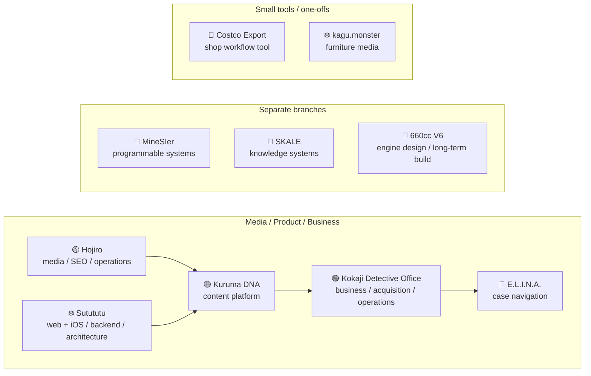

<!-- If you're reading the source: hello. Scope creep lives here. -->

# Hodzilla51 👋

<p align="center">
  
</p>

**Product Manager / Software Engineer**

個人では、気になったものを作って公開しています。反応があれば続けるし、なければ止めることもあります。  
Webメディア、調査事業、Minecraft内のコンピュータなど、ジャンルはあまり決めずにやっています。

<details>
<summary><strong>English</strong></summary>
<br>

I build things that catch my interest and put them out in the world. If people use them, I keep going; if not, I sometimes stop.  
That has included web media, an investigation business, and programmable computers inside Minecraft.

</details>

`🟢 Active`　`🧪 Experimental`　`🟡 Maintenance`　`❄️ Paused / Frozen`

## 🚀 現在のプロジェクト / Active Projects

### 🟢 [クルマのDNA / Kuruma DNA](https://kuruma-dna.com/)

自動車のモデルや世代のつながり、設計思想をたどるWebメディア。企画・サイト開発・コンテンツ設計・SEO・運用改善まで行っています。Next.jsとWordPressを組み合わせ、車種・世代を横断して読み進められる情報構造や、大規模なコンテンツ運用の改善・自動化にも取り組んでいます。

**Areas:** Next.js / TypeScript / WordPress / SEO / Information Architecture

<details><summary>English</summary><br>
An automotive media platform focused on model lineage and engineering ideas. I work across product planning, development, content architecture, SEO, and operation, including improvements and automation for large-scale content management.
</details>

### 🟡 [ほおじろ通信 / Hojiro](https://hojiro.tokyo/)

バイク・ガジェット・キャンプなどを扱う個人メディア。かなり前から運営していて、検索需要の見つけ方や記事設計、SEO、サイト改善はだいたいここで覚えました。

**Areas:** WordPress / Content Strategy / SEO / Media Operations

<details><summary>English</summary><br>
A long-running personal media site covering motorcycles, gadgets, camping, and related topics. Most of what I know about search demand, content design, SEO, and running a media site started here.
</details>

### 🟢 [小鍛治探偵事務所 / Kokaji Detective Office](https://kkjd.tokyo/)

自分で立ち上げた調査事業。サイトを作るだけではなく、相談・受注の流れ、SEO/MEO、広告、案件の運用まで含めて実際に回しています。

**Areas:** Product / Business Design / Web Development / SEO & MEO / Operations

<details><summary>English</summary><br>
An investigation business I started myself. The work goes beyond the website: inquiry flow, acquisition, SEO/MEO, ads, and day-to-day operations are all part of the project.
</details>

## 🧪 Experiments / Side quests

本筋とは別に、気になったものを試している枠です。完成するものもあれば、途中で満足して止まるものもあります。

### 🧪 [MineSIer](https://github.com/hodzilla51/minesier)

Minecraft内に、JavaScriptでプログラムできるコンピュータ、ロボット、ストレージ、ネットワークを作るFabric Mod。Mozilla Rhinoの実行環境、プログラマブルTurtle、仮想NIC、L2通信、学習スイッチ、IPv4風パケット、暗号APIなどを実装しています。

**Tech:** Java / JavaScript / Fabric / Mozilla Rhino / Virtual Networking / Cryptography

<details><summary>English</summary><br>
An experimental Minecraft mod for building programmable computers, robots, storage, and networks in-game with JavaScript. It includes a Rhino runtime, programmable turtles, virtual NICs, L2 networking, a learning switch, IPv4-inspired packets, and cryptographic APIs.
</details>

### 🧪 [SKALE](https://github.com/hodzilla51/skale)

司法試験で使う法的推論を、人間が限られた時間と記憶容量で実行できるサイズまで圧縮できるか試しているもの。まだ初期実験で、効くかどうかは分かっていません。

**Areas:** Knowledge Compression / Legal Reasoning / Human-executable Systems / Evaluation Design

<details><summary>English</summary><br>
An experiment in compressing legal reasoning for Japanese legal exams into something a human can actually remember and execute under exam constraints. Still early; no claim that it works yet.
</details>

### 🧪 E.L.I.N.A.
**Event-Linked Intelligence & Navigation Agent**

探偵案件を「管理する」のではなく、**一件ずつ攻略するためのナビゲーションシステム**。

依頼内容と現在地から、次にやるべきことを `NEXT OBJECTIVE` として1つだけ提示します。Objectiveの中には通過すべき `Waypoint` があり、法的・業務的に進めない場所には `Gate` がある。新しい情報が入れば `Quest Map` を書き換え、次の一手を組み直します。

```text
Where are we?
What do we do next?
How do we do it?
When is it done?
```

案件をきれいに並べるためのCRMではなく、この4つを毎回決めるためのものです。

現在は、問い合わせからの状態構築、複数段の推論、Quest Map、NEXT OBJECTIVE、法定手続のGate、再計画、行動ログまで動くところまで作っています。

**Tech:** Next.js / TypeScript / PostgreSQL / LLM agents / Constraint-driven design

<details><summary>English</summary><br>
E.L.I.N.A. is not a case-management system. It is a navigation system for **beating one investigation at a time**.

It reads the current state of a case and produces exactly one `NEXT OBJECTIVE`. Objectives contain `Waypoints`; legal and operational constraints become `Gates`; new information can reshape the `Quest Map` and trigger a replan.

The point is not to keep cases neatly organized. It is to answer four questions over and over: `Where are we? What do we do next? How do we do it? When is it done?`
</details>

### 🧪 Costco Export

友人が運営するコストコ再販店向けに作った業務ツール。公開されている商品ページから必要な商品情報を取得し、ExcelやCSV、商品画像をまとめて出力できるようにしました。実際に店舗の業務で使われていました。

**Tech:** Next.js / TypeScript / Puppeteer / Cheerio / ExcelJS / Sharp

<details><summary>English</summary><br>
An internal tool I built for a friend's Costco resale shop. It collects product information from publicly available product pages and packages the data into Excel/CSV files together with product images. It was used in the shop's actual workflow.
</details>

### 🧪 660cc Two-Stroke V6

軽自動車規格の排気量上限に収まる **659.9cc・水冷60° V型6気筒2ストロークエンジン**を、いつか実機として製作するために進めている長期の個人プロジェクトです。

単なる思考実験として終わらせるつもりはなく、最終的にはエンジンを実際に製作し、車両として成立させることを目標にしています。現時点では実機製作に必要な資金・製造環境がないため、今のうちからFusion 360によるパラメトリックCAD、クランクトレイン、慣性バランス、一次圧縮、ポートタイミング、掃気通路、潤滑、排気波動などの設計・解析を少しずつ進めています。

現在の基本仕様は **659.9cc（110.0cc × 6） / φ54.1 × 47.9mm / 60°等間隔点火**。15,500〜16,500rpm付近を想定回転域とし、**250PS級のクランク軸出力を未検証の設計目標**としています。

CAD上では掃気通路を含むクランクケース容積を実測し、実効一次圧縮比を1.27として算定。ポート期間・時間面積や慣性力・偶力も計算しており、現在は **1Dガス交換シミュレーションによる成立性検証**へ進む段階です。派生構想として、低負荷域を4ストローク、高負荷・高回転域を2ストロークとする可変サイクル機構も検討しています。

**Areas:** Engine Design / Fusion 360 / Two-Stroke Gas Exchange / Kinematics & Balance / Exhaust Wave Dynamics / 1D Simulation

📄 **[外部公開用技術資料 — 660cc 2ストロークV6エンジンの概念設計・成立性検討 (PDF)](./docs/660cc-v6-public.pdf)**

<details><summary>English</summary><br>

A long-term personal engineering project aimed at eventually **building a real 659.9 cc, liquid-cooled, 60° V6 two-stroke engine** within Japan's kei-car displacement limit.

This is not intended to remain a thought experiment. The long-term goal is to manufacture the engine and make it work as part of an actual vehicle. I do not currently have the funding or manufacturing environment required for a physical build, so I am using the time now to advance the design, analysis, specifications, and validation plan step by step.

The current baseline is 659.9 cc (110.0 cc/cylinder), 54.1 × 47.9 mm bore/stroke, and evenly spaced 60° firing intervals. The target operating range is approximately 15,500–16,500 rpm, with **250 PS-class crankshaft output as an unverified design target**, not a measured result.

CAD-derived crankcase and transfer-passage volumes give an effective primary compression ratio of 1.27. Port timing/time-area and inertial balance have also been calculated, and the next major step is **1D gas-exchange simulation**. A separate extension of the project explores a variable 2-stroke / 4-stroke operating cycle.

</details>

## ❄️ 凍結・過去のプロジェクト / Paused & Archived

今は積極的に触っていないもの。消すほどでもないので、そのまま残しています。

### ❄️ Sutututu

サーキット走行の記録を投稿し、サーキット・レイアウト・車種などで絞り込んで比較するSNS。二輪・四輪を対象に、ユーザー認証、記録投稿、検索、リザルト表示などを開発しました。

Web版だけでなく、**Expo / React NativeでiOSアプリも作り、公開まで行いました。** モバイル版ではFirebaseの認証・Firestore・Crashlyticsなども使っています。

開発中に何度も構成を変えていて、React / Go / Cassandra / Keycloak / Docker の構成から、Next.js / Node.js / PostgreSQL中心の構成まで試しています。設計資料・コード抜粋は[技術ポートフォリオ](https://github.com/hodzilla51/portfolio)に残しています。

**Tech:** React / Next.js / Expo / React Native / Go / Node.js / PostgreSQL / Cassandra / Firebase / Keycloak / Docker

<details><summary>English</summary><br>
A social platform for recording and comparing circuit-driving results across circuits, layouts, and vehicles. Alongside the web service, I also built and released an iOS app with Expo / React Native, using Firebase for authentication, Firestore, and Crashlytics.

I rebuilt the architecture several times, from React / Go / Cassandra / Keycloak / Docker to a Next.js / Node.js / PostgreSQL stack.
</details>

### ❄️ kagu.monster

家具に特化した情報サイト。Next.jsで作って公開までしましたが、現在は凍結中です。

<details><summary>English</summary><br>
A furniture-focused information site built with Next.js. It made it to release, but is currently frozen.
</details>

## 🗺️ Project Map



この系統では、ほおじろ通信が一番古いです。SutututuでWebサービスの設計や実装をかなりやって、その両方で得たものがKDNAに入っています。KKJDはさらにその延長線上で、E.L.I.N.A.はKKJDの中から生えた実験です。MineSIer、SKALE、660cc V6はほぼ別世界です。

<details><summary>English</summary><br>
Hojiro is the oldest project in the main line. Sutututu added a lot of hands-on web-service and backend work, and Kuruma DNA grew out of both. Kokaji Detective Office continues that line, with E.L.I.N.A. branching from it. MineSIer, SKALE, and the 660 cc V6 idea live in almost entirely different worlds.
</details>

## 🛠 技術・関心領域 / Tech & Interests

| Area | Technologies / Topics |
| --- | --- |
| Web | TypeScript, React, Next.js, WordPress |
| Mobile | Expo, React Native, Firebase |
| Backend & Data | Go, Node.js, PostgreSQL, MySQL |
| Systems | Java, Docker, Linux, Virtual Networking |
| Product | Requirements, Information Architecture, SEO, Analytics, Operations |
| Experiments | AI Automation, Knowledge Systems, Minecraft Modding, Vehicle Engineering |

技術そのものよりも、**「何を作るために、どう組み合わせるか」**に興味があります。

<details><summary>English</summary><br>
I'm less interested in collecting technologies than in figuring out how to combine them to build something useful — or occasionally something unnecessarily weird.
</details>

<details>
<summary><strong>🕹️ Debug console</strong></summary>
<br>

```text
$ ./hodzilla status
role            Product Manager / Software Engineer
project_count   suspiciously high
scope_creep     detected
response        creating another repository
build_state     green enough

$ ./hodzilla philosophy
build → ship → observe → improve → accidentally invent another project
```

</details>

## 📡 Telemetry


### 🐍 Grass collection subsystem

<picture>
  <source media="(prefers-color-scheme: dark)" srcset="https://raw.githubusercontent.com/hodzilla51/hodzilla51/output/github-contribution-grid-snake-dark.svg" />
  <source media="(prefers-color-scheme: light)" srcset="https://raw.githubusercontent.com/hodzilla51/hodzilla51/output/github-contribution-grid-snake.svg" />
  
</picture>

---

> Build things. Ship them. See what happens.
